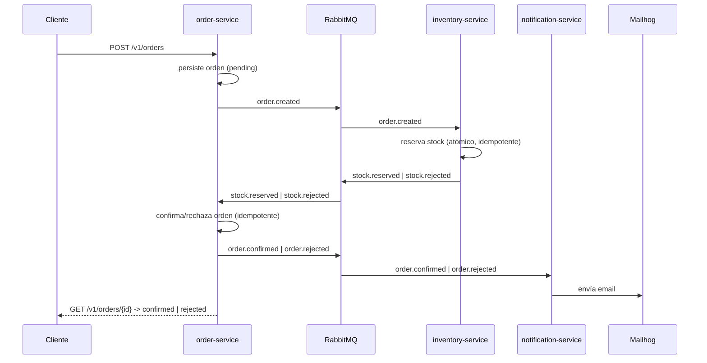

# Event-Driven Orders

> Sistema de procesamiento de órdenes basado en eventos — microservicios asíncronos en **Python 3.12 / FastAPI** comunicados por **RabbitMQ**, con **Clean Architecture + DDD**.
> Portfolio project: idempotencia, atomicidad anti race-condition, DLQ + retries con backoff, observabilidad (logging JSON + correlation IDs) y tests e2e contra infraestructura real.

[](.github/workflows/ci.yml)
[](https://www.python.org/)
[](https://fastapi.tiangolo.com/)
[](#testing)
[](#testing)
[](#testing)

---

## Qué es

Sistema de e-commerce dividido en **3 microservicios** que se comunican exclusivamente por **eventos** a través de un message broker (RabbitMQ), demostrando comunicación asíncrona, idempotencia, dead-letter queues, retries con backoff y eventual consistency.

```
   [Cliente]
       │ POST /v1/orders
       ▼
┌──────────────┐   order.created     ┌──────────────────┐
│ order-service│ ───────────────────▶│ inventory-service│
│  (FastAPI)   │◀─────────────────── │  reserva stock    │
└──────┬───────┘  stock.reserved /   └──────────────────┘
       │          stock.rejected
       │ order.confirmed / order.rejected
       ▼
┌─────────────────────┐
│ notification-service │  envía email (Mailhog)
└─────────────────────┘
```



## Servicios

| Servicio | Tipo | Responsabilidad |
|---|---|---|
| `order-service` | FastAPI (REST + consumer) | Crea órdenes, orquesta el ciclo de vida, expone `/v1/orders` |
| `inventory-service` | Worker (consumer) | Reserva stock con transacción atómica anti race-condition |
| `notification-service` | Worker (consumer) | Envía notificaciones por email (Mailhog) |

## Stack

| Capa | Tecnología |
|---|---|
| Lenguaje | Python 3.12 |
| Framework HTTP | FastAPI + Uvicorn |
| Mensajería | RabbitMQ + `aio-pika` |
| Persistencia | PostgreSQL 16 (database-per-service) + SQLAlchemy + Alembic |
| Validación / contratos | Pydantic v2 |
| Email (dev) | Mailhog (SMTP + API de inspección) |
| Observabilidad | `structlog` (logging JSON) + correlation ID por contexto |
| Testing | pytest, pytest-asyncio, `testcontainers` (Postgres real), httpx |
| Lint / types | ruff + mypy |
| Infra | Docker Compose |
| CI/CD | GitHub Actions |

## Arquitectura

Cada servicio aplica **Clean Architecture + DDD** (capas `domain` / `application` / `infrastructure` / `presentation` / `di`), siguiendo el patrón del proyecto [Monolith](https://github.com/MauriDev94/Api_monolith).

- **El broker es un detalle de infraestructura.** Los use cases hablan con el puerto `EventPublisher` (`application/contracts/`); la implementación con `aio-pika` vive en `infrastructure/messaging/`.
- **`presentation/` = puntos de entrada (adapters).** En `order-service`: `presentation/http/` (routers + schemas) y `presentation/consumers/` (handlers de eventos). En los workers: solo `presentation/consumers/`.
- **`shared/contracts/`** es la única fuente de los *integration events* (Pydantic): los servicios no comparten entidades de dominio, solo estos modelos viajan por el broker. Cada servicio mapea entre su dominio y estos contratos.
- **`shared/messaging/`** y **`shared/observability/`** son infraestructura transversal (retry/DLQ y logging) reusada por los 3 servicios — nunca lógica de negocio.
- **database-per-service:** `order-service` y `inventory-service` tienen cada uno su Postgres; `notification-service` no tiene DB (consumer puro).

## Patrones demostrados

| Patrón | Dónde | Qué resuelve |
|---|---|---|
| **Idempotencia** (`processed_events`) | `order-service`, `inventory-service` | RabbitMQ es *at-least-once*: un evento redelivered no duplica efectos de negocio (`INSERT ... ON CONFLICT DO NOTHING` sobre `event_id`, misma transacción que la lógica de negocio) |
| **Atomicidad anti race-condition** | `inventory-service` | `UPDATE products SET available_quantity = available_quantity - :qty WHERE sku = :sku AND available_quantity >= :qty` + `SAVEPOINT` por orden (all-or-nothing) — Postgres serializa vía row-level locking |
| **DLQ + retries con backoff** | `shared/messaging/` (3 servicios) | 3 etapas (5s/30s/2m) vía colas TTL + dead-letter, header `x-retry-count`, clasificación transient/permanent |
| **Eventual consistency** | flujo completo | La orden pasa por `pending -> confirmed/rejected` de forma asíncrona, sin transacción distribuida |
| **Correlation ID end-to-end** | HTTP -> eventos -> 3 consumers | `structlog.contextvars` propaga el mismo id desde el `X-Correlation-ID` del request hasta cada log de cada servicio |
| **Logging estructurado (JSON)** | `shared/observability/` | Toda línea de log (propia o de librerías) sale como JSON filtrable con `jq` |
| **Database-per-service** | `order-service`, `inventory-service` | Cada servicio es dueño exclusivo de su esquema; integración solo por eventos |

## Estructura del monorepo

```
event-driven-orders/
├── docker-compose.yml          # RabbitMQ + 2x Postgres + Mailhog + 3 servicios
├── .env.example                # variables para docker-compose
├── Makefile                    # install / up / down / logs / ps / test / lint / format / e2e
├── .github/                    # CI (ci.yml) + plantillas de PR/issues + CODEOWNERS
├── shared/
│   ├── contracts/               # integration events (Pydantic): BaseEvent + Order*/Stock*
│   ├── messaging/                # retry policy + dispatcher (DLQ/backoff), reusado por los 3 servicios
│   └── observability/            # logging JSON (structlog) + correlation id contextvars
├── tests/e2e/                   # tests e2e contra el stack real (make e2e)
└── services/
    ├── order-service/          # FastAPI: REST + consumer (feature: orders)
    ├── inventory-service/      # worker: consumer (feature: inventory)
    └── notification-service/   # worker: consumer, sin DB (feature: notifications)
```

Cada servicio: `app/{core,common,features/<feature>/{domain,application,infrastructure,presentation,di}}`.

## Puesta en marcha

```bash
cp .env.example .env
make up        # docker compose up -d --build
make ps        # ver healthchecks
make logs      # seguir logs
make down      # detener
```

| Servicio / infra | URL local |
|---|---|
| order-service `/health` | http://localhost:8001/health |
| inventory-service `/health` | http://localhost:8002/health |
| notification-service `/health` | http://localhost:8003/health |
| RabbitMQ Management | http://localhost:15672 (guest/guest) |
| Mailhog UI | http://localhost:8025 |
| Postgres orders / inventory | localhost:5433 / localhost:5434 |

### Catálogo seed (`inventory-service`)

La migración inicial siembra estos productos para poder probar el flujo sin datos manuales:

| SKU | Stock inicial |
|---|---|
| `SKU-001` | 100 |
| `SKU-002` | 50 |
| `SKU-003` | 25 |
| `SKU-004` | 10 |
| `SKU-005` | 5 |

## Cómo probar el flujo end-to-end a mano

Con el stack arriba (`make up`), todo el flujo se dispara con un solo POST.

### Camino feliz (stock suficiente)

```bash
# bash / curl
curl -X POST http://localhost:8001/v1/orders \
  -H "Content-Type: application/json" \
  -d '{"customer_id": "c-1", "lines": [{"product_id": "SKU-001", "quantity": 1, "unit_price": "10.00"}]}'
```

```powershell
# PowerShell
$body = @{
    customer_id = "c-1"
    lines = @(@{ product_id = "SKU-001"; quantity = 1; unit_price = "10.00" })
} | ConvertTo-Json

Invoke-RestMethod -Uri http://localhost:8001/v1/orders -Method Post -Body $body -ContentType "application/json"
```

Tras unos segundos:

```bash
curl http://localhost:8001/v1/orders/<order_id>   # status: "confirmed"
```
```powershell
Invoke-RestMethod -Uri "http://localhost:8001/v1/orders/<order_id>"   # status: "confirmed"
```

Y en Mailhog (http://localhost:8025) llega un email "Your order `<order_id>` is confirmed" a `c-1@example.com`.

### Camino de rechazo (stock insuficiente)

Pedí más de lo que hay (`SKU-005` solo tiene 5 unidades):

```bash
curl -X POST http://localhost:8001/v1/orders \
  -H "Content-Type: application/json" \
  -d '{"customer_id": "c-2", "lines": [{"product_id": "SKU-005", "quantity": 999, "unit_price": "10.00"}]}'
```

```powershell
$body = @{
    customer_id = "c-2"
    lines = @(@{ product_id = "SKU-005"; quantity = 999; unit_price = "10.00" })
} | ConvertTo-Json

Invoke-RestMethod -Uri http://localhost:8001/v1/orders -Method Post -Body $body -ContentType "application/json"
```

La orden termina en `status: "rejected"` y llega un email "Your order `<order_id>` was rejected" con el motivo (`insufficient stock for product SKU-005`) a `c-2@example.com`.

### Verificar la reconexión al broker

1. `make up` — esperar a que los 3 servicios reporten `"broker": "healthy"` en `/health`.
2. `docker compose restart rabbitmq` (o `docker compose stop rabbitmq` y luego `start rabbitmq` para simular un cold start más largo).
3. Mientras RabbitMQ está caído, `/health` de los 3 servicios debe reportar `"broker": "unhealthy"` — pero los procesos siguen corriendo (no crashean, no hace falta `docker compose restart <servicio>`).
4. Cuando RabbitMQ vuelve a estar disponible, los logs (`docker compose logs -f order-service inventory-service notification-service`) muestran `"connected to broker after N attempt(s)"` y `/health` vuelve a `"broker": "healthy"` solo, sin intervención manual.
5. Probar el flujo end-to-end (sección de arriba) para confirmar que los consumers siguen procesando eventos tras la reconexión.

### Inspeccionar DLQ y trazas

- **RabbitMQ Management** (`guest`/`guest`): pestaña *Queues*, buscar `<service>.<queue>.dlq` o `.retry-5s/30s/2m`.
- **Logs por correlation ID**:
  ```bash
  docker compose logs order-service inventory-service notification-service --no-color \
    | grep -o '{.*}' \
    | jq -c 'select(.correlation_id == "<id>")'
  ```

## Testing

### Entorno de desarrollo local (venv compartido)

```bash
make install                     # crea .venv e instala runtime + dev de los 3 servicios
source .venv/Scripts/activate    # Windows (Git Bash) — Unix: .venv/bin/activate
```

### Unit + integración (TDD)

Cada servicio se desarrolló con **TDD** (Red -> Green -> Refactor). Los tests de integración de `order-service` e `inventory-service` corren contra **PostgreSQL real** vía `testcontainers` — SQLite no tiene `FOR UPDATE` ni row-level locking, lo que haría pasar los tests de race-condition/idempotencia sin probar nada.

```bash
make lint      # ruff check + ruff format --check + mypy en los 3 servicios + ruff sobre shared
make test      # pytest con cobertura en los 3 servicios + shared (respeta el gate)
make format    # ruff format (auto-formatea los 3 servicios + shared)

# por servicio:
cd services/order-service && pytest -q --cov=app
```

| Servicio | Tests | Cobertura | Gate |
|---|---|---|---|
| `order-service` | 55+ | ~92% | 85 |
| `inventory-service` | 29+ | ~85% | 40 |
| `notification-service` | 31+ | ~92% | 85 |
| `shared` | 23+ | — | — |

> Local: se lanza automáticamente un `PostgresContainer("postgres:16-alpine")` (requiere Docker). CI: el job `tests-db` levanta un service container Postgres 16 y el conftest detecta `CI=true`.

### Tests e2e (`tests/e2e/`)

Ejercitan el **stack real completo** (RabbitMQ + 2x Postgres + Mailhog + los 3 servicios), levantado con `make up` — sin mocks ni dependency overrides. Se observa el resultado solo a través de fronteras públicas: la API HTTP de `order-service` y la API de Mailhog (`/api/v2/messages`).

```bash
make up        # levanta el stack completo
make e2e        # instala deps de tests/e2e/ y corre pytest -m e2e
```

Cubren:

- **Camino feliz**: `POST /v1/orders` con `SKU-001` (stock=100) -> polling hasta `status == "confirmed"` -> verifica el email de confirmación en Mailhog.
- **Camino de rechazo**: `POST /v1/orders` con `SKU-005` pidiendo `quantity=999` -> polling hasta `status == "rejected"` -> verifica el email de rechazo (incluye el SKU insuficiente) en Mailhog.

Ambos usan **polling con timeout** (`wait_until`, sin `sleep` fijos) porque la propagación entre servicios es asíncrona. Marcados `@pytest.mark.e2e`.

Dos decisiones sobre el **alcance** de esta suite están registradas como ADR:

- **[ADR-0017](docs/adr/0017-tests-e2e-solo-local-no-en-ci.md) — los e2e corren solo en local, no en CI.** Levantar y *buildear* 5 contenedores en cada push haría el pipeline lento y más flaky, sin aportar señal sobre un PR individual que los gates por servicio (`quality` + `tests-db`/`tests`) no den antes. `make e2e` queda como verificación pre-PR / smoke test de release.
- **[ADR-0018](docs/adr/0018-idempotencia-no-se-verifica-e2e-black-box.md) — la idempotencia no se cubre e2e.** Verificarla desde el borde público exigiría leer las bases de otros servicios o exponer un endpoint ad-hoc para testing; se cubre a nivel de **integración contra Postgres real**, asertando sobre `processed_events` y `available_quantity`.

## Despliegue

Stack listo para correr en una VM Linux con Docker Compose + Caddy (HTTPS
automático):

- `docker-compose.prod.yml`: override de producción (sin exponer Postgres/AMQP
  al host, `restart: always`, agrega `caddy`).
- `deploy/Caddyfile`: reverse proxy — `order-service` público, RabbitMQ
  Management UI y Mailhog UI detrás de basic auth.
- `deploy/env.production.example`: variables de entorno de producción (copiar
  a `.env.production`).
- `deploy/deploy.sh`: re-deploy idempotente (`git pull` + `up -d --build`).

```bash
docker compose -f docker-compose.yml -f docker-compose.prod.yml \
  --env-file .env.production up -d --build
```

## CI/CD

GitHub Actions (`.github/workflows/ci.yml`) corre en cada push y PR a `main`:

| Job | Qué hace |
|---|---|
| `quality` (matrix x 3 servicios) | `ruff check` + `ruff format --check` + `mypy app` |
| `quality-shared` | `ruff check` + `ruff format --check` sobre `shared/` |
| `tests-db` (matrix: order, inventory) | `pytest` con cobertura sobre un **Postgres 16** efímero (service container con healthcheck `pg_isready`) |
| `tests` (notification) | `pytest` con cobertura, sin DB |

- **Python 3.12** con cache de `pip` por servicio. `actions/checkout@v4`, `actions/setup-python@v5`, `actions/upload-artifact@v4`.
- **Coverage gate:** vive en cada `pyproject.toml` (`[tool.coverage.report] fail_under`). `order-service` y `notification-service` están en **85**; `inventory` sigue en **40** (piso post-scaffold).
- El `coverage.xml` de cada servicio se sube como artefacto (`coverage-<servicio>`).
- **Secret opcional `CI_DB_PASSWORD`:** password del Postgres de CI. Si no está seteado, el workflow usa un valor descartable para que el CI quede verde sin configuración manual.
- Los **tests e2e no corren en CI** ([ADR-0017](docs/adr/0017-tests-e2e-solo-local-no-en-ci.md)).

---

## Decisiones de arquitectura

Cada decisión relevante está registrada como un **ADR** (Architecture Decision Record) en [`docs/adr/`](docs/adr/README.md): el contexto que la motivó, las alternativas evaluadas y sus consecuencias — incluidas las limitaciones aceptadas.

Las más significativas:

| ADR | Decisión | Por qué importa |
|---|---|---|
| [0005](docs/adr/0005-publish-after-commit-en-vez-de-outbox.md) | Publish-after-commit en vez de outbox transaccional | La base de datos y el broker son dos sistemas distintos: la ventana de *dual-write* se acepta y se documenta, no se esconde |
| [0006](docs/adr/0006-idempotencia-con-processed-events.md) | Idempotencia en la misma transacción que el negocio | RabbitMQ es *at-least-once*; `INSERT ... ON CONFLICT` + Unit of Work hacen que reprocesar sea un no-op |
| [0007](docs/adr/0007-reserva-de-stock-atomica.md) | Reserva de stock con `UPDATE` condicional + `SAVEPOINT` | Elimina el *check-then-act*: PostgreSQL serializa vía row-level locking |
| [0011](docs/adr/0011-retry-con-backoff-y-dlq.md) | Retry con backoff de 3 etapas + DLQ sin plugins | Colas TTL + dead-letter, con clasificación transient/permanent |
| [0012](docs/adr/0012-logging-json-y-correlation-id.md) | Correlation ID end-to-end | Una orden se traza por los 3 servicios con un solo `jq` |
| [0013](docs/adr/0013-resiliencia-de-conexion-al-broker.md) | Retry en cold start + watchdog | `connect_robust` no reintenta el primer connect: un servicio quedaba zombie tras un arranque en frío |
| [0008](docs/adr/0008-tests-contra-postgres-real.md) | Tests de integración contra PostgreSQL real | Con SQLite, los tests de race-condition pasan sin probar nada |

**[Ver los 18 ADRs →](docs/adr/README.md)**

---

## Mejoras futuras (post-MVP)

- **Outbox transaccional** para eliminar la ventana de dual-write *publish-after-commit* ([ADR-0005](docs/adr/0005-publish-after-commit-en-vez-de-outbox.md)).
- **Tracing distribuido** (OpenTelemetry + Jaeger) — el correlation ID end-to-end ([ADR-0012](docs/adr/0012-logging-json-y-correlation-id.md)) ya es la base para esta instrumentación.
- **Auth en `order-service`** (JWT) para proteger `/v1/orders`.
- **Customer directory service** para resolver `customer_id -> email` real (hoy es un placeholder `{customer_id}@example.com`).
- **Idempotencia persistente en `notification-service`** (`processed_events`) para reemplazar el dedup en memoria, que no sobrevive reinicios ([ADR-0009](docs/adr/0009-notification-service-sin-base-de-datos.md)).
- **Orquestación con Kubernetes** — hoy el deploy de producción es Docker Compose en una sola VM (ver [Despliegue](#despliegue)).

---

## Observabilidad: métricas con Prometheus y Grafana (Fase 9)

El sistema expone el **pilar de métricas** como complemento al logging JSON estructurado (Fase 6).

### Stack

| Componente | Puerto | Descripción |
|---|---|---|
| **Prometheus** | `9090` | Scraping de los 3 servicios + RabbitMQ |
| **Grafana** | `3000` | Dashboard con provisioning automático |
| **RabbitMQ** metrics | `15692` | Plugin `rabbitmq_prometheus` |

### Métricas custom (prefijo `edo_`)

| Métrica | Tipo | Labels | Descripción |
|---|---|---|---|
| `edo_events_processed_total` | Counter | `service`, `event_type` | Eventos procesados exitosamente |
| `edo_events_dlq_total` | Counter | `queue` | Eventos enviados a DLQ |
| `edo_events_retried_total` | Counter | `queue` | Reintentos de eventos |
| `edo_event_processing_seconds` | Histogram | `service` | Latencia de procesamiento |

HTTP metrics automáticas (por servicio) vía `prometheus-fastapi-instrumentator`.

### Levantar el stack de observabilidad

```bash
docker compose up -d prometheus grafana
```

- **Prometheus**: <http://localhost:9090>
- **Grafana**: <http://localhost:3000> (user: `admin` / pass: `admin`)

El dashboard **Event-Driven Orders** carga automáticamente al iniciar Grafana (provisioning). Incluye paneles para throughput, latencia p95, DLQ, reintentos y profundidad de colas RabbitMQ.

### Screenshot del dashboard

> _TODO: agregar screenshot del dashboard en producción tras primer deploy en Oracle Cloud._

## Estado

**MVP completo.** Los 3 servicios, el flujo end-to-end, DLQ + retries con backoff, observabilidad (logging JSON + correlation ID + métricas) y el stack de despliegue están implementados y cubiertos por tests.

Lo que queda fuera del alcance está en [Mejoras futuras](#mejoras-futuras-post-mvp); el porqué de cada decisión —y de cada limitación aceptada— está en el [registro de ADRs](docs/adr/README.md).
