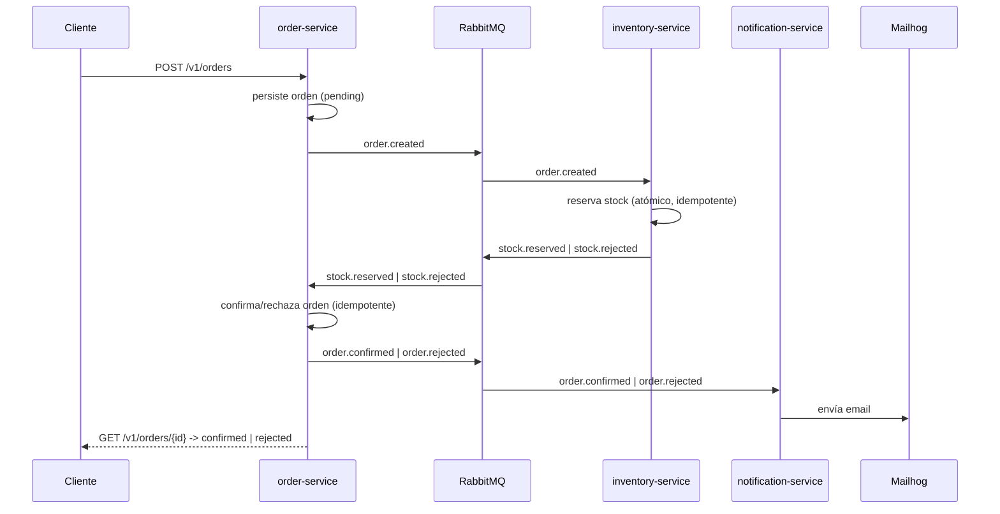

# Event-Driven Orders

> Sistema de procesamiento de órdenes basado en eventos — microservicios asíncronos en **Python 3.12 / FastAPI** comunicados por **RabbitMQ**, con **Clean Architecture + DDD**.
> Portfolio project: idempotencia, atomicidad anti race-condition, DLQ + retries con backoff, observabilidad (logging JSON + correlation IDs) y tests e2e contra infraestructura real.

[](.github/workflows/ci.yml)
[](https://www.python.org/)
[](https://fastapi.tiangolo.com/)
[](#testing)
[](#testing)
[](#testing)

---

## Qué es

Sistema de e-commerce dividido en **3 microservicios** que se comunican exclusivamente por **eventos** a través de un message broker (RabbitMQ), demostrando comunicación asíncrona, idempotencia, dead-letter queues, retries con backoff y eventual consistency.

```
   [Cliente]
       │ POST /v1/orders
       ▼
┌──────────────┐   order.created     ┌──────────────────┐
│ order-service│ ───────────────────▶│ inventory-service│
│  (FastAPI)   │◀─────────────────── │  reserva stock    │
└──────┬───────┘  stock.reserved /   └──────────────────┘
       │          stock.rejected
       │ order.confirmed / order.rejected
       ▼
┌─────────────────────┐
│ notification-service │  envía email (Mailhog)
└─────────────────────┘
```



## Servicios

| Servicio | Tipo | Responsabilidad |
|---|---|---|
| `order-service` | FastAPI (REST + consumer) | Crea órdenes, orquesta el ciclo de vida, expone `/v1/orders` |
| `inventory-service` | Worker (consumer) | Reserva stock con transacción atómica anti race-condition |
| `notification-service` | Worker (consumer) | Envía notificaciones por email (Mailhog) |

## Stack

| Capa | Tecnología |
|---|---|
| Lenguaje | Python 3.12 |
| Framework HTTP | FastAPI + Uvicorn |
| Mensajería | RabbitMQ + `aio-pika` |
| Persistencia | PostgreSQL 16 (database-per-service) + SQLAlchemy + Alembic |
| Validación / contratos | Pydantic v2 |
| Email (dev) | Mailhog (SMTP + API de inspección) |
| Observabilidad | `structlog` (logging JSON) + correlation ID por contexto |
| Testing | pytest, pytest-asyncio, `testcontainers` (Postgres real), httpx |
| Lint / types | ruff + mypy |
| Infra | Docker Compose |
| CI/CD | GitHub Actions |

## Arquitectura

Cada servicio aplica **Clean Architecture + DDD** (capas `domain` / `application` / `infrastructure` / `presentation` / `di`), siguiendo el patrón del proyecto [Monolith](https://github.com/MauriDev94/Api_monolith).

- **El broker es un detalle de infraestructura.** Los use cases hablan con el puerto `EventPublisher` (`application/contracts/`); la implementación con `aio-pika` vive en `infrastructure/messaging/`.
- **`presentation/` = puntos de entrada (adapters).** En `order-service`: `presentation/http/` (routers + schemas) y `presentation/consumers/` (handlers de eventos). En los workers: solo `presentation/consumers/`.
- **`shared/contracts/`** es la única fuente de los *integration events* (Pydantic): los servicios no comparten entidades de dominio, solo estos modelos viajan por el broker. Cada servicio mapea entre su dominio y estos contratos.
- **`shared/messaging/`** y **`shared/observability/`** son infraestructura transversal (retry/DLQ y logging) reusada por los 3 servicios — nunca lógica de negocio.
- **database-per-service:** `order-service` y `inventory-service` tienen cada uno su Postgres; `notification-service` no tiene DB (consumer puro).

## Patrones demostrados

| Patrón | Dónde | Qué resuelve |
|---|---|---|
| **Idempotencia** (`processed_events`) | `order-service`, `inventory-service` | RabbitMQ es *at-least-once*: un evento redelivered no duplica efectos de negocio (`INSERT ... ON CONFLICT DO NOTHING` sobre `event_id`, misma transacción que la lógica de negocio) |
| **Atomicidad anti race-condition** | `inventory-service` | `UPDATE products SET available_quantity = available_quantity - :qty WHERE sku = :sku AND available_quantity >= :qty` + `SAVEPOINT` por orden (all-or-nothing) — Postgres serializa vía row-level locking |
| **DLQ + retries con backoff** | `shared/messaging/` (3 servicios) | 3 etapas (5s/30s/2m) vía colas TTL + dead-letter, header `x-retry-count`, clasificación transient/permanent |
| **Eventual consistency** | flujo completo | La orden pasa por `pending -> confirmed/rejected` de forma asíncrona, sin transacción distribuida |
| **Correlation ID end-to-end** | HTTP -> eventos -> 3 consumers | `structlog.contextvars` propaga el mismo id desde el `X-Correlation-ID` del request hasta cada log de cada servicio |
| **Logging estructurado (JSON)** | `shared/observability/` | Toda línea de log (propia o de librerías) sale como JSON filtrable con `jq` |
| **Database-per-service** | `order-service`, `inventory-service` | Cada servicio es dueño exclusivo de su esquema; integración solo por eventos |

## Estructura del monorepo

```
event-driven-orders/
├── docker-compose.yml          # RabbitMQ + 2x Postgres + Mailhog + 3 servicios
├── .env.example                # variables para docker-compose
├── Makefile                    # install / up / down / logs / ps / test / lint / format / e2e
├── .github/                    # CI (ci.yml) + plantillas de PR/issues + CODEOWNERS
├── shared/
│   ├── contracts/               # integration events (Pydantic): BaseEvent + Order*/Stock*
│   ├── messaging/                # retry policy + dispatcher (DLQ/backoff), reusado por los 3 servicios
│   └── observability/            # logging JSON (structlog) + correlation id contextvars
├── tests/e2e/                   # tests e2e contra el stack real (make e2e)
└── services/
    ├── order-service/          # FastAPI: REST + consumer (feature: orders)
    ├── inventory-service/      # worker: consumer (feature: inventory)
    └── notification-service/   # worker: consumer, sin DB (feature: notifications)
```

Cada servicio: `app/{core,common,features/<feature>/{domain,application,infrastructure,presentation,di}}`.

## Puesta en marcha

```bash
cp .env.example .env
make up        # docker compose up -d --build
make ps        # ver healthchecks
make logs      # seguir logs
make down      # detener
```

| Servicio / infra | URL local |
|---|---|
| order-service `/health` | http://localhost:8001/health |
| inventory-service `/health` | http://localhost:8002/health |
| notification-service `/health` | http://localhost:8003/health |
| RabbitMQ Management | http://localhost:15672 (guest/guest) |
| Mailhog UI | http://localhost:8025 |
| Postgres orders / inventory | localhost:5433 / localhost:5434 |

### Catálogo seed (`inventory-service`)

La migración inicial siembra estos productos para poder probar el flujo sin datos manuales:

| SKU | Stock inicial |
|---|---|
| `SKU-001` | 100 |
| `SKU-002` | 50 |
| `SKU-003` | 25 |
| `SKU-004` | 10 |
| `SKU-005` | 5 |

## Cómo probar el flujo end-to-end a mano

Con el stack arriba (`make up`), todo el flujo se dispara con un solo POST.

### Camino feliz (stock suficiente)

```bash
# bash / curl
curl -X POST http://localhost:8001/v1/orders \
  -H "Content-Type: application/json" \
  -d '{"customer_id": "c-1", "lines": [{"product_id": "SKU-001", "quantity": 1, "unit_price": "10.00"}]}'
```

```powershell
# PowerShell
$body = @{
    customer_id = "c-1"
    lines = @(@{ product_id = "SKU-001"; quantity = 1; unit_price = "10.00" })
} | ConvertTo-Json

Invoke-RestMethod -Uri http://localhost:8001/v1/orders -Method Post -Body $body -ContentType "application/json"
```

Tras unos segundos:

```bash
curl http://localhost:8001/v1/orders/<order_id>   # status: "confirmed"
```
```powershell
Invoke-RestMethod -Uri "http://localhost:8001/v1/orders/<order_id>"   # status: "confirmed"
```

Y en Mailhog (http://localhost:8025) llega un email "Your order `<order_id>` is confirmed" a `c-1@example.com`.

### Camino de rechazo (stock insuficiente)

Pedí más de lo que hay (`SKU-005` solo tiene 5 unidades):

```bash
curl -X POST http://localhost:8001/v1/orders \
  -H "Content-Type: application/json" \
  -d '{"customer_id": "c-2", "lines": [{"product_id": "SKU-005", "quantity": 999, "unit_price": "10.00"}]}'
```

```powershell
$body = @{
    customer_id = "c-2"
    lines = @(@{ product_id = "SKU-005"; quantity = 999; unit_price = "10.00" })
} | ConvertTo-Json

Invoke-RestMethod -Uri http://localhost:8001/v1/orders -Method Post -Body $body -ContentType "application/json"
```

La orden termina en `status: "rejected"` y llega un email "Your order `<order_id>` was rejected" con el motivo (`insufficient stock for product SKU-005`) a `c-2@example.com`.

### Verificar la reconexión al broker

1. `make up` — esperar a que los 3 servicios reporten `"broker": "healthy"` en `/health`.
2. `docker compose restart rabbitmq` (o `docker compose stop rabbitmq` y luego `start rabbitmq` para simular un cold start más largo).
3. Mientras RabbitMQ está caído, `/health` de los 3 servicios debe reportar `"broker": "unhealthy"` — pero los procesos siguen corriendo (no crashean, no hace falta `docker compose restart <servicio>`).
4. Cuando RabbitMQ vuelve a estar disponible, los logs (`docker compose logs -f order-service inventory-service notification-service`) muestran `"connected to broker after N attempt(s)"` y `/health` vuelve a `"broker": "healthy"` solo, sin intervención manual.
5. Probar el flujo end-to-end (sección de arriba) para confirmar que los consumers siguen procesando eventos tras la reconexión.

### Inspeccionar DLQ y trazas

- **RabbitMQ Management** (`guest`/`guest`): pestaña *Queues*, buscar `<service>.<queue>.dlq` o `.retry-5s/30s/2m`.
- **Logs por correlation ID**:
  ```bash
  docker compose logs order-service inventory-service notification-service --no-color \
    | grep -o '{.*}' \
    | jq -c 'select(.correlation_id == "<id>")'
  ```

## Testing

### Entorno de desarrollo local (venv compartido)

```bash
make install                     # crea .venv e instala runtime + dev de los 3 servicios
source .venv/Scripts/activate    # Windows (Git Bash) — Unix: .venv/bin/activate
```

### Unit + integración (TDD)

Cada servicio se desarrolló con **TDD** (Red -> Green -> Refactor). Los tests de integración de `order-service` e `inventory-service` corren contra **PostgreSQL real** vía `testcontainers` — SQLite no tiene `FOR UPDATE` ni row-level locking, lo que haría pasar los tests de race-condition/idempotencia sin probar nada.

```bash
make lint      # ruff check + ruff format --check + mypy en los 3 servicios + ruff sobre shared
make test      # pytest con cobertura en los 3 servicios + shared (respeta el gate)
make format    # ruff format (auto-formatea los 3 servicios + shared)

# por servicio:
cd services/order-service && pytest -q --cov=app
```

| Servicio | Tests | Cobertura | Gate |
|---|---|---|---|
| `order-service` | 55+ | ~92% | 85 |
| `inventory-service` | 29+ | ~85% | 40 |
| `notification-service` | 31+ | ~92% | 85 |
| `shared` | 23+ | — | — |

> Local: se lanza automáticamente un `PostgresContainer("postgres:16-alpine")` (requiere Docker). CI: el job `tests-db` levanta un service container Postgres 16 y el conftest detecta `CI=true`.

### Tests e2e (`tests/e2e/`)

Ejercitan el **stack real completo** (RabbitMQ + 2x Postgres + Mailhog + los 3 servicios), levantado con `make up` — sin mocks ni dependency overrides. Se observa el resultado solo a través de fronteras públicas: la API HTTP de `order-service` y la API de Mailhog (`/api/v2/messages`).

```bash
make up        # levanta el stack completo
make e2e        # instala deps de tests/e2e/ y corre pytest -m e2e
```

Cubren:

- **Camino feliz**: `POST /v1/orders` con `SKU-001` (stock=100) -> polling hasta `status == "confirmed"` -> verifica el email de confirmación en Mailhog.
- **Camino de rechazo**: `POST /v1/orders` con `SKU-005` pidiendo `quantity=999` -> polling hasta `status == "rejected"` -> verifica el email de rechazo (incluye el SKU insuficiente) en Mailhog.

Ambos usan **polling con timeout** (`wait_until`, sin `sleep` fijos) porque la propagación entre servicios es asíncrona. Marcados `@pytest.mark.e2e`.

**Decisión: e2e solo local, no en CI.** Levantar y *buildear* 5 contenedores (RabbitMQ + 2 Postgres + Mailhog + 3 servicios) en cada push haría el pipeline lento y más flaky (tiempos de arranque variables en runners compartidos), sin aportar señal sobre cada PR individual — los gates de calidad por servicio (`quality` + `tests-db`/`tests`) ya corren en cada uno. `make e2e` queda como verificación pre-PR / smoke test de release.

**Decisión: idempotencia no se cubre con un test e2e black-box.** Verificarla de punta a punta requeriría leer `processed_events` o `available_quantity` directo de la base de datos de `inventory-service`/`order-service` desde el test — rompiendo la encapsulación database-per-service que el resto de la suite e2e respeta — o exponer un endpoint de solo-lectura creado ad-hoc para testing. La idempotencia ya está cubierta donde tiene sentido probarla: a nivel de **integración con Postgres real**, asertando directamente sobre `processed_events` y `available_quantity` (`test_order_created_retry_dlq.py`, `test_inventory_results_retry_dlq.py`, `test_order_events_retry_dlq.py`, Fases 2/3/5).

## Despliegue

Stack listo para correr en una VM Linux con Docker Compose + Caddy (HTTPS
automático):

- `docker-compose.prod.yml`: override de producción (sin exponer Postgres/AMQP
  al host, `restart: always`, agrega `caddy`).
- `deploy/Caddyfile`: reverse proxy — `order-service` público, RabbitMQ
  Management UI y Mailhog UI detrás de basic auth.
- `deploy/env.production.example`: variables de entorno de producción (copiar
  a `.env.production`).
- `deploy/deploy.sh`: re-deploy idempotente (`git pull` + `up -d --build`).

```bash
docker compose -f docker-compose.yml -f docker-compose.prod.yml \
  --env-file .env.production up -d --build
```

## CI/CD

GitHub Actions (`.github/workflows/ci.yml`) corre en cada push y PR a `main`:

| Job | Qué hace |
|---|---|
| `quality` (matrix x 3 servicios) | `ruff check` + `ruff format --check` + `mypy app` |
| `quality-shared` | `ruff check` + `ruff format --check` sobre `shared/` |
| `tests-db` (matrix: order, inventory) | `pytest` con cobertura sobre un **Postgres 16** efímero (service container con healthcheck `pg_isready`) |
| `tests` (notification) | `pytest` con cobertura, sin DB |

- **Python 3.12** con cache de `pip` por servicio. `actions/checkout@v4`, `actions/setup-python@v5`, `actions/upload-artifact@v4`.
- **Coverage gate:** vive en cada `pyproject.toml` (`[tool.coverage.report] fail_under`). `order-service` y `notification-service` están en **85**; `inventory` sigue en **40** (piso post-scaffold).
- El `coverage.xml` de cada servicio se sube como artefacto (`coverage-<servicio>`).
- **Secret opcional `CI_DB_PASSWORD`:** password del Postgres de CI. Si no está seteado, el workflow usa un valor descartable para que el CI quede verde sin configuración manual.
- Los **tests e2e no corren en CI** (ver sección Testing).

---

## Decisiones de arquitectura

### Fase 0 — Scaffold + infraestructura

- **Build context = raíz del repo** (no la carpeta del servicio): cada `Dockerfile` se referencia vía `build.dockerfile` para poder copiar `shared/` dentro de cada imagen.
- **`shared/contracts/` como única fuente de los integration events.** Los servicios no comparten entidades de dominio; solo estos modelos Pydantic viajan por el broker.
- **El broker es un detalle de infraestructura.** Los use cases dependen del puerto `EventPublisher` (en `application/contracts/`); la implementación con `aio-pika` vive en `infrastructure/messaging/`.
- **`presentation/` = puntos de entrada (adapters).** En `order-service`: `presentation/http/` (routers + schemas) y `presentation/consumers/` (handlers de eventos). En los workers: solo `presentation/consumers/`.
- **Workers exponen un FastAPI mínimo solo para `/health`** (probe de Docker/k8s).
- **`/health` siempre responde 200** y reporta el estado de cada dependencia (DB/broker) en el body — distingue "proceso arriba" de "dependencia degradada" sin depender del status code.
- **database-per-service:** `order-service` y `inventory-service` tienen cada uno su Postgres; `notification-service` no tiene DB.
- **Deps por servicio:** `requirements.txt` (runtime) + `requirements-dev.txt` (pytest/ruff) + `pyproject.toml` (config de ruff/mypy/pytest). Mismo patrón que el proyecto Monolith de referencia.

### Fase 1 — `order-service`: crear orden + publicar `OrderCreated`

- **Use case asíncrono (`AsyncUseCase`).** El puerto `EventPublisher.publish` es `async` (aio-pika), así que `CreateOrder.execute` tiene que poder `await`. Se añadió una base `AsyncUseCase` separada de la `UseCase` síncrona (`GetOrder`) para que el límite sync/async sea explícito a nivel de tipos.
- **Consistencia: publish-after-commit (MVP).** El use case primero persiste+commitea la orden y *después* publica `OrderCreated`. Deja una ventana de *dual-write*: si la publicación falla, la orden existe pero no se emitió el evento. El endurecimiento es un **outbox transaccional** (fuera de alcance del MVP).
- **El use case retorna la entidad de dominio `Order`**; el endpoint la mapea a `OrderResponse` con un mapper de presentación (Domain Entity -> Response Schema). La entidad nunca se expone directa como respuesta HTTP.
- **`declare_topology()` en el `lifespan`.** Idempotente en RabbitMQ, seguro en cada arranque. Si el broker no está disponible, el arranque sigue resiliente y `/health` lo reporta degradado.
- **Rutas versionadas (`/v1/orders`).**
- **Migraciones con Alembic** (`env.py` resuelve la URL desde `DATABASE_URL` o `db_*`). El contenedor corre `alembic upgrade head` al arrancar.
- **Tests sin infraestructura real** (Fase 1): integración con SQLite in-memory + publisher spy (retrofit a Postgres real en Fase 3).

### Fase 2 — `inventory-service`: reserva atómica + idempotencia

- **Idempotencia vía tabla `processed_events`.** El `event_id` se registra dentro de la **misma transacción** que los decrementos de stock con `INSERT ... ON CONFLICT DO NOTHING`. Si ya existía -> `rowcount == 0` -> ACK sin re-procesar y sin re-publicar.
- **Reserva atómica anti race-condition.**
  ```sql
  UPDATE products
  SET    available_quantity = available_quantity - :qty
  WHERE  sku = :sku AND available_quantity >= :qty
  ```
  Postgres evalúa el `WHERE` con row-level locking: dos transacciones concurrentes para el mismo SKU se serializan. `rowcount == 0` -> stock insuficiente. `SAVEPOINT reserve_all` envuelve todos los decrementos (all-or-nothing).
- **Unit of Work (UoW) como contrato de transacción.** `register_event` + `reserve_all` comparten la misma sesión; `uow.commit()` los confirma juntos. Sigue existiendo la ventana publish-after-commit (mismo patrón Fase 1); endurecimiento = outbox transaccional.
- **Tests con PostgreSQL real (testcontainers).** SQLite no tiene `FOR UPDATE`/row-level locking real, lo que haría pasar los tests de race-condition sin probar nada. CI usa el service container; local usa `PostgresContainer`.
- **Migración Alembic + seed de productos** (`SKU-001..005`, ver tabla más arriba) para poder probar el flujo sin datos manuales.
- **Consumer como adapter puro.** `build_order_created_handler` es una factory: deserializa, construye params, invoca el use case, ACK. Cero lógica de negocio en el consumer.

### Fase 3 — `order-service`: confirmar/rechazar + idempotencia

- Consumer `inventory_results_consumer.py` consume `StockReserved`/`StockRejected` -> use cases `ConfirmOrder`/`RejectOrder` -> publica `OrderConfirmed`/`OrderRejected`.
- Idempotencia atómica con tabla `processed_events` y `OrderUnitOfWork`, mismo patrón que Fase 2.
- Retrofit de los tests de integración a Postgres real (antes SQLite), para mantener la garantía de idempotencia probada con row-level locking real.

### Fase 4 — `notification-service`: email vía SMTP/Mailhog

- **Sin idempotencia persistente (limitación documentada del MVP).** A diferencia de `order-service`/`inventory-service`, `notification-service` no tiene base de datos por diseño — es un consumer puro que solo habla con SMTP. Un redelivery de `OrderConfirmed`/`OrderRejected` puede reenviar el mismo email. Se acepta para el MVP: un email duplicado es molesto pero no corrompe estado de negocio. Mitigado parcialmente en Fase 5 (`InMemoryEventDeduplicator`).
- **Destinatario derivado del `customer_id` (limitación documentada del MVP).** Los eventos llevan `customer_id`, no un email. Sin un customer-service, el mapper deriva un placeholder determinístico `{customer_id}@example.com`.
- **Patrón factory del consumer** (igual que Fases 2/3): `build_order_events_handler(use_case)` deserializa, dispatch por `event_type` (`order.confirmed`/`order.rejected`), mapea, ejecuta el use case y ACK. `event_type` desconocido -> NACK sin requeue (dead-letter).
- **Puerto `EmailSender`, no `smtplib` directo.** `SmtpEmailSender` (target Mailhog) vive en `infrastructure/email/`; los tests de integración mockean `smtplib.SMTP`.

### Fase 5 — DLQ + retries con backoff

- **Retry-with-backoff + DLQ compartidos en `shared/messaging/`.** `retry_policy.py` (clasificación de errores + decisión retry/DLQ, puro) y `retry_dispatcher.py` (`wrap_with_retry`, side-effecting: ack/nack/republish) se implementaron una vez y se reusan en los 3 servicios.
- **Backoff de 3 etapas vía colas TTL + DLX (sin plugins).** Por cada cola principal `<queue>` se declaran `<queue>.retry-5s` (TTL 5s), `<queue>.retry-30s` (TTL 30s) y `<queue>.retry-2m` (TTL 120s), cada una con `x-dead-letter-exchange: ""` + `x-dead-letter-routing-key: <queue>` — al expirar el TTL el mensaje vuelve solo a la cola principal. `MAX_RETRIES = 3`.
- **Contador de intentos en header `x-retry-count`.** Si el handler falla y la excepción es `TRANSIENT` con reintentos disponibles, se republica a `<queue>.retry-{etapa}` con `x-retry-count` incrementado y se ACKea el mensaje original. `PERMANENT` o reintentos agotados -> `nack(requeue=False)` -> `<queue>.dlq`.
- **Clasificación transient vs permanent.** `pydantic.ValidationError`, `json.JSONDecodeError` y `ValueError` (payload malformado / `event_type`/outcome desconocido) son **PERMANENT** -> DLQ inmediato. Cualquier otra excepción (caída de Postgres/SMTP) es **TRANSIENT** -> sigue el backoff.
- **Fix de un bug de Fases 1-4: DLQ "fantasma".** Las 3 colas principales declaraban `x-dead-letter-exchange: "orders.dlx"`, un exchange topic nunca declarado ni bindeado -> cualquier `nack(requeue=False)` perdía el mensaje silenciosamente. Corregido usando el exchange por defecto (`""`) + `x-dead-letter-routing-key: <queue>.dlq`. Cubierto por `tests/integration/test_topology.py` en los 3 servicios.
- **Idempotencia hace que los reintentos sean seguros.** `order-service`/`inventory-service` ya tenían `processed_events`; `notification-service` agrega `InMemoryEventDeduplicator` (set acotado FIFO de `event_id` vistos). Limitación documentada: no sobrevive reinicios del proceso.
- **Inspeccionar las DLQ:** RabbitMQ Management -> *Queues* -> `<service>.<queue>.dlq` (botón *Get messages* muestra body + headers `x-retry-count`/`x-death`).

### Fase 6 — Observabilidad: logging JSON + correlation ID

- **Logging estructurado (JSON) centralizado en `shared/observability/`.** `configure_logging(service_name)` configura `structlog` + `logging` estándar para que toda línea (propia o de librerías como `uvicorn`/`aio-pika`) salga como JSON con `timestamp`, `level`, `logger`, `event`, `service` y campos contextuales. Dos cadenas de procesadores (structlog + `foreign_pre_chain` para `logging` estándar) terminan en el mismo `JSONRenderer`.

  ```json
  {"timestamp": "2026-06-10T12:00:00Z", "level": "info", "logger": "app.core.middleware.correlation_id",
   "event": "request completed", "service": "order-service", "correlation_id": "a1b2c3d4-...",
   "method": "POST", "path": "/v1/orders", "status_code": 201, "duration_ms": 12.4}
  ```

- **Correlation ID end-to-end vía `structlog.contextvars`.** `shared/observability/context.py` expone `bound_correlation_id(id)` y `get_correlation_id()`. Mientras el contexto está bindeado, todas las líneas de log llevan `correlation_id` gracias al processor `merge_contextvars`.
- **Middleware de correlation ID + request logging en `order-service`.** Por request: lee `X-Correlation-ID` (o genera `uuid4()`), bindea el id durante todo el request, emite `"request completed"` (`method`/`path`/`status_code`/`duration_ms`) y devuelve el id en el header de respuesta.
- **Propagación a través del broker.** `BaseEvent.correlation_id` viaja en cada evento. `map_order_to_order_created` setea `correlation_id = get_correlation_id() or order.id` — separa la **identidad de negocio** (`order.id`, estable) de la **identidad de traza** (`correlation_id`, por request/cadena de eventos). En el otro extremo, `wrap_with_retry` extrae `correlation_id` del body del evento entrante y lo bindea durante el `dispatch` — único punto de integración para los 3 consumers.
- **Filtrar logs por `correlation_id`** con `jq` (ver "Inspeccionar DLQ y trazas" más arriba) traza una orden de punta a punta a través de los 3 servicios.
- **Tests de comportamiento para logging.** Configuración de logging = infraestructura pura (efecto secundario global), así que en vez de TDD clásico se escribieron tests de comportamiento con `structlog.testing.LogCapture` (no `capture_logs()`, que en structlog 26.x reemplaza toda la cadena de procesadores y descarta `merge_contextvars`).

### Fase 7 — Tests e2e + README final

- **Tests e2e en `tests/e2e/`** contra el stack real levantado con `make up` (ver sección Testing más arriba para el detalle de cobertura y las decisiones sobre CI e idempotencia).
- **mypy sobre `shared/`:** el error preexistente documentado en Fase 6 (`shared/messaging/retry_dispatcher.py:56`) no reproduce con la configuración actual (`mypy --ignore-missing-imports`, mismas stubs que usan los servicios) y `shared/` no forma parte del gate de `make lint`/CI (que solo corre `ruff check shared`). Se deja documentado por si se decide en el futuro agregar `mypy` a `quality-shared`.

### Fase 8a — Resiliencia de conexión al broker

- **Gotcha resuelto: cold start sin reconexión.** Hasta esta fase, los 3 servicios usaban `aio_pika.connect_robust()` (que ya maneja reconexión automática **una vez conectado**), pero `connect_robust` con `fail_fast=True` (default) **no reintenta el primer connect**: si RabbitMQ todavía no está listo cuando el servicio arranca, la excepción se loguea y el `lifespan` queda con `broker.is_connected == False` para siempre — requería un restart manual.
- **`connect_with_retry` en `shared/messaging/connection.py`** (junto a `RabbitMQConnection`, antes duplicada en los 3 servicios — ahora una sola fuente, mismo criterio DRY que `wrap_with_retry`/observabilidad). Backoff exponencial capado (`base_delay=1s`, `max_delay=30s`, dobla cada intento).
- **Retry acotado al arranque + watchdog en background.** El `lifespan` intenta conectar hasta `max_attempts=5` veces (1+2+4+8s ≈ 15s, cubre el caso normal de cold start en `docker compose`). Si sigue sin poder conectar, lanza una tarea en background (`max_attempts=None`, backoff capado a 30s) que reintenta indefinidamente y completa la declaración de topología + el consumer apenas el broker responde — **sin restart manual**.
- **Reconexión en caliente: gratis vía `connect_robust`.** Una vez lograda la primera conexión, si RabbitMQ se cae y vuelve, `connect_robust` reconecta solo y re-declara exchanges/queues/bindings/consumers registrados en su `RobustChannel` — no requiere código propio.
- **Logging estructurado de cada intento/reconexión** (`%s: broker connection attempt %d failed...`, `%s: connected to broker after %d attempt(s)`) para poder operar el sistema en producción.
- **Tests:** `shared/tests/test_connection.py` cubre la lógica de retry/backoff de forma pura (connector mockeado, sin I/O real): éxito al primer intento, reintentos con backoff exponencial, agotamiento de `max_attempts`, retry indefinido, cap de `max_delay`, y clasificación de errores transitorios vs no-relacionados a conexión. Cada servicio agrega un test de integración (`test_lifespan_broker_reconnect.py`) que verifica el wiring lifespan -> watchdog -> `_start_consuming`. La reconexión real de `connect_robust` no se testea con testcontainers (sería lento y básicamente testearía la librería); su comportamiento queda documentado arriba y se verifica a mano (ver "Verificar la reconexión al broker" más abajo).

### Fase 8b — Preparación de deploy

- **`docker-compose.prod.yml` como override**, no como reemplazo: se usa con
  `-f docker-compose.yml -f docker-compose.prod.yml`. Mantiene un único
  archivo base para dev/prod y aísla las diferencias de producción
  (`restart: always`, sin exponer Postgres/AMQP al host, servicio `caddy`).
- **`!reset []` para limpiar `ports` heredados.** Docker Compose por defecto
  concatena listas entre archivos (no las reemplaza), así que remover el
  port mapping al host de los Postgres/RabbitMQ requiere la sintaxis
  `!reset` (Compose Specification, soportada desde Compose v2.24). En
  versiones más viejas el tag se ignora sin error pero no limpia la lista —
  documentado como requisito en `docker-compose.prod.yml`.
- **Mailhog se mantiene en producción** (decisión de portfolio): el objetivo
  es que un reclutador pueda hacer `POST /v1/orders` y ver el email
  capturado en la Mailhog UI, sin depender de un proveedor SMTP real.
- **Caddy como único punto de entrada** (puertos 80/443, HTTPS automático vía
  Let's Encrypt). Solo `order-service` (API + `/docs`), RabbitMQ Management UI
  y Mailhog UI son alcanzables desde internet — las dos últimas protegidas con
  `basicauth` en subdominios (`rabbitmq.<dominio>`, `mailhog.<dominio>`). Las
  bases de datos nunca se exponen.
- **Dominio parametrizable vía `DOMAIN`.** Se recomienda `sslip.io`
  (`<ip-con-guiones>.sslip.io`) para no depender de un dominio propio: resuelve
  automáticamente la IP y cualquier subdominio, permitiendo HTTPS con Caddy
  sin configuración de DNS adicional.
- **Gotcha: escapado de `$` en hashes bcrypt.** Docker Compose interpola `$VAR`
  dentro de los valores de `.env`; un hash bcrypt (`$2a$14$...`) se trunca y
  genera warnings si no se escribe con `$$` (`$$2a$$14$$...`). Documentado en
  `deploy/env.production.example`.
- **Esta fase no despliega nada.** Deja el repo listo (compose override,
  Caddyfile, `.env` de ejemplo); el deploy real en la VM (Oracle Cloud Always
  Free) es manual y queda para la Fase 8c.

---

## Mejoras futuras (post-MVP)

- **Outbox transaccional** para eliminar la ventana de dual-write *publish-after-commit* (Fases 1/2/3).
- **Tracing distribuido** (OpenTelemetry + Jaeger) y métricas (Prometheus/Grafana) — el correlation ID end-to-end (Fase 6) ya es la base para esta instrumentación.
- **Auth en `order-service`** (JWT) para proteger `/v1/orders`.
- **Customer directory service** para resolver `customer_id -> email` real (hoy es un placeholder `{customer_id}@example.com`).
- **Idempotencia persistente en `notification-service`** (`processed_events`) para reemplazar el dedup en memoria (no sobrevive reinicios).
- **Orquestación con Kubernetes** — hoy el deploy de producción es Docker Compose en una sola VM (ver [Despliegue](#despliegue)).

## Estado del MVP

- [x] **Fase 0** — Scaffold + `docker-compose` (RabbitMQ + Postgres + Mailhog) + CI/CD
- [x] **Fase 1** — `order-service`: POST /orders + GET /orders/{id} + publica `OrderCreated`
- [x] **Fase 2** — `inventory-service`: consume `OrderCreated`, reserva atómica + idempotencia
- [x] **Fase 3** — `order-service`: consume `StockReserved`/`StockRejected`, idempotencia, publica `OrderConfirmed`/`OrderRejected`
- [x] **Fase 4** — `notification-service`: consume `OrderConfirmed`/`OrderRejected` -> email vía Mailhog
- [x] **Fase 5** — DLQ + retries con backoff (3 etapas) en los 3 servicios
- [x] **Fase 6** — Observabilidad: logging JSON + correlation ID end-to-end
- [x] **Fase 7** — Tests e2e del flujo completo + README final
- [x] **Fase 8a** — Resiliencia de conexión al broker: retry con backoff en cold start + reconexión automática
- [x] **Fase 8b** — Preparación de deploy: `docker-compose.prod.yml` + Caddy (HTTPS), listo para desplegar (Fase 8c: ejecución manual en VM)

**MVP completo.** Mejoras futuras listadas arriba.
